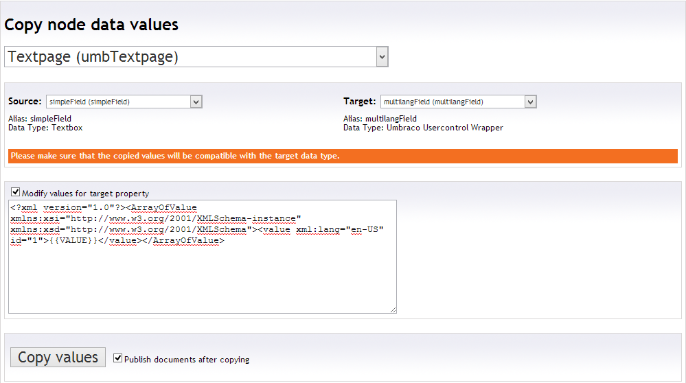

Value Duplicator for Umbraco
============================

**This dashboard control (in the settings section) allows you to copy property values to a different property on the same document. Documents can be selected by their document type.**

## What does it do?
It is especially useful if you need to **copy/move already existing document data** from one datatype to another; i.e. from a simple 'Textstring' to the 'Dictionary Datatype' for multilingual values. If you (optionally) supply a text pattern string, the source value can be surrounded by XML or the likes or data can be appended or prepended.

You can also easily duplicate fields to let editors work on them (but not outputting to the website) just in the backend and copy the update date back to the originating property at a specified date or event -- and publish if needed.

By providing this functionality as a dashboard control, admins, power-users and frontenders are not dependend on developers if they would like to **refactor website content** for example. 

Compatible with Umbraco 4.9+ (including version 6.1+)

## How does it look?

## How to use it?
Point. Click.

[Here's a short screencast](http://www.screenr.com/pRhH) to get you started.

##Download: Ready to use as an Umbraco Package
You can [download](http://our.umbraco.org/projects/backoffice-extensions/value-duplicator "Download the Package") Value Duplicator as a ready to use Umbraco package and plug it into your site easily. The package installer only adds a dashboard item to the "Settings" section, so the risk of wrecking your CMS installation extremely low. 

##Licence
Licensed under the [Apache License, Version 2.0](http://www.apache.org/licenses/LICENSE-2.0.html), which allows open source as well as commercial use.

##Author
Follow [esn303](https://twitter.com/esn303 "@esn303") on Twitter. Like [mindrevolution](https://www.facebook.com/mindrevolution) on Facebook. 

This project is open for collaboration. **Fork. Push. Innovate.**

